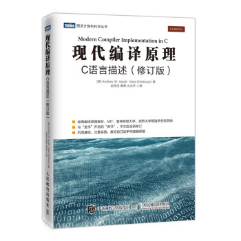

# tigerI(mplement)

Book 《现代编译原理 c语言实现》 Exercise and Implement

会参考[Lua-v5.0](https://github.com/lua/lua/tree/v5.0) 的代码，
因为`Lua` 的源码量比较少，相对简单，并且词法和语法都是手动实现的，可以借鉴。

也参考了这两个实现

- [travmygit/TigerCompiler](https://github.com/travmygit/TigerCompiler)
- [kentang-mit/TigerCompiler](https://github.com/kentang-mit/TigerCompiler)

## 环境

- **flex 2.6.4**
- **bison 3.8.2**

## 笔记、总结、感想

- [词法分析](notes/ch2.md)
- [语法分析、抽象语法](notes/ch3-4.md)
- [语义分析](notes/ch5.md)
- [活动记录、翻译成中间代码](notes/ch6-7.md)
- [基本块和轨迹](notes/ch8.md)

